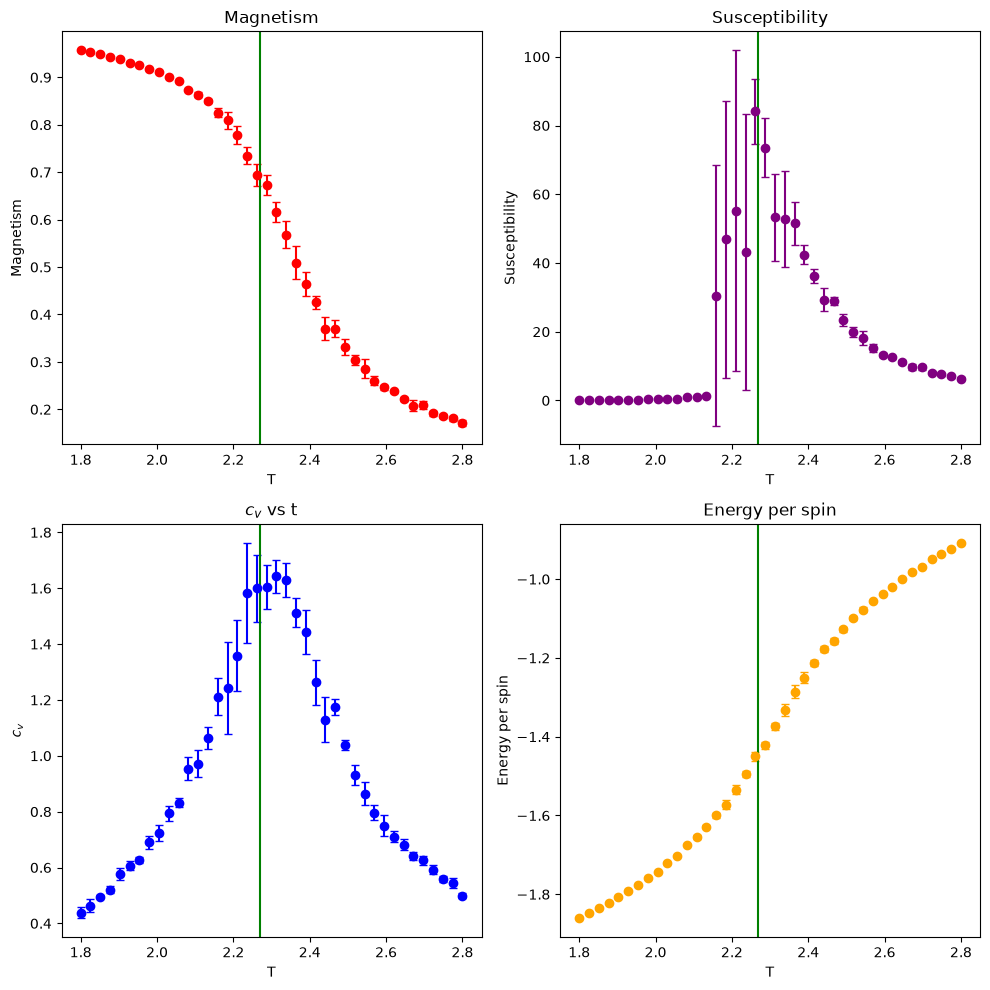
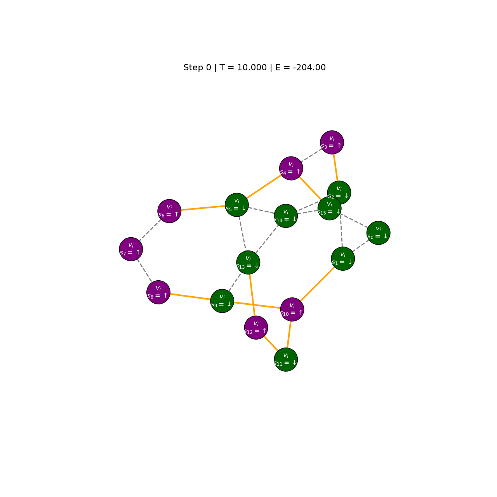
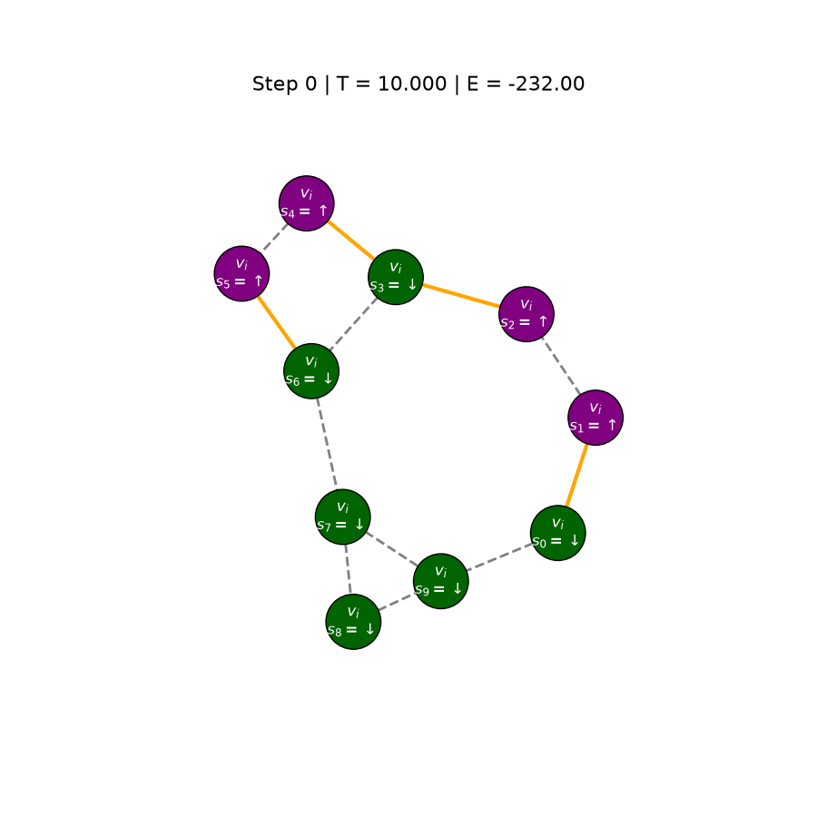

  
 

# QUBO and Ising Formulations of Optimisation Problems
 
### Simulated annealing from Combinatorial Optimisation to Optimal Control
 

  

## Overview

This repo has my code and graphs from my summer research project where we reformulated optimisation problems as the search for minimum-energy states of an **Ising** or **QUBO** energy landscape. We developed a Monte Carlo Markov Chain framework to find these low-energy states, building up from the Metropolis algorithm to simulated annealing.
 
With this annealing framework in place, we investigated a sequence of established combinatorial problems, working through their constructions in detail, teaching us the techniques needed to translate constraints and objectives into energy contributions. We then extended this to a continuous problem: a **mixed-integer optimal control formulation of a 1D rocket trajectory**, encoding continuous position and velocity variables as binary and enforcing the rocket's dynamics as constraint terms. Annealing the resulting Q matrix showed that optimal control problems of this kind can be expressed in a form that naturally extends to **probabilistic computing hardware**.
 
The project was supervised by **Professor Stefano Sanvito** and **Michael Mitchell**.

## Structure
The Structure of the the project:
- [Ising/](Ising/) Implementing the Metropolis algorithm and simulated annealing for 2D Ising systems
- [example-problems/](example-problems/) Formulating classic NP-hard combinatorial problems as QUBOs and solving them via annealing
- [rocket_trajectory/](rocket_trajectory/) Extending these ideas to a mixed-integer optimal control problem (1D rocket trajectory) expressed as a QUBO

## Animations & FIgures

### Ising model
Some Ising model observables plotted to test our annealing framework, $\chi$ didn't quite work at $T_c$ due to correlation of our samples.
$$
\begin{align}
    \langle E\rangle=\frac{1}{N^2}\left(-\frac1 2\sum^N_{ij }J_{ij}\sigma_i\sigma_j-\sum_i^Nh_i\sigma_i\right)=\text{average }E
\end{align}
$$

$$
\begin{align}
    \langle m \rangle=\frac{1}{N^2}\sum_i\sigma_i=\text{average}~\sigma
\end{align}
$$

$$
\begin{align}
    c_v&=-\left. \frac{\partial}{\partial T}\frac{\partial lnZ}{\partial\beta}\right|_v
    =\frac{1}{k_BT^2}\left(\langle E^2\rangle-\langle E \rangle^2\right)=\frac{\text{Variance}~E}{k_BT^2}\\
\end{align}
$$

$$
\begin{align}
    \chi=\lim_{B\rightarrow0}\frac{\partial\langle m \rangle}{\partial B}=\cdots=\frac{N^2}{k_BT}\left(\langle m^2\rangle-\langle m \rangle^2\right)=\frac{N^2\times\text{Variance}~m}{k_BT}
\end{align}
$$

### Combinatorial Problems
Some annealing plots from graph partition problem:

Take some undirected graph G(V, E) and n colours. Can we colour each vertex such that no edge connects vertices of the same colour? 

$$
\begin{align}
H&=2A\sum_{i>j}^ Ns_is_j -\frac{B}{2}\sum_{(i,j)\in E}  s_is_j
\end{align}
$$

<table>
  <tr>
    <td></td>
    <td></td>
  </tr>
</table>

If you want to check out other combinatorial problems we worked through such as graph colouring and the Travelling Salesman Problem, check out the first draft of our [report](report.pdf) 
